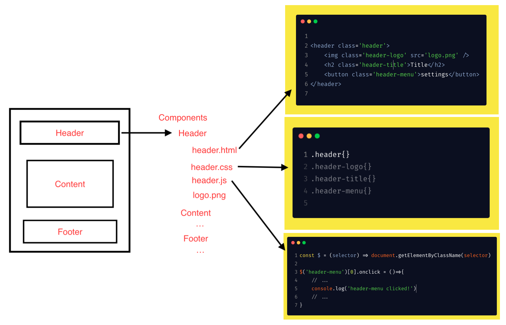

# 什么是前端工程化

> 首先，没有银弹，前端工程化也是一个焦油坑。（没有银弹、焦油坑，摘自《人月神话》）

- 广义

  > 把软件工程的方法和原理应用到前端开发中，目的是实现 `高效开发`，`有效协同`，`质量可控`。

- 狭义：

  > 将 `开发阶段` 的代码转变成 `生产环境` 的代码的 `一系列步骤`，主要包括 `构建` 、`分支管理` 、`自动化测试`, `部署` 等，为了提升前端开发效率和运行性能而做的一系列工作。

  没有特别说明，一般指的就是狭义上的前端工程。

  **工程化的最终目的是让业务开发可以 100% 聚焦在业务逻辑上**。

「**银弹**」： 银色子弹，在欧洲民间传说及 19 世纪以来哥特小说风潮的影响下(《黑夜传说》)，银色子弹往往被描绘成具有驱魔功效的武器，是针对狼人等超自然怪物的特效武器。后来也被比喻为具有极端有效性的解决方法，作为杀手锏、最强杀招、王牌等的代称。

「**没有银弹**」：没有任何技术或管理上的进展， 能够独立地许诺十年内使软件系统项目生产率、 可靠性或简洁性获得数量级上的进步。

「**焦油坑**」：表面上看起来好像没有任何一个单独的问题会导致困难， 每个都能被解决， 但是当它们相互纠缠和累积在一起的时候， 团队的行动就会变得越来越慢。 对问题的麻烦程度， 每个人似乎都会感到惊讶， 并且很难看清问题的本质。最终导致项目进度严重滞后或者干脆以失败而告终。

强烈推荐，读一读这本书，虽然与技术无关，但通过这本书，能够改变对这个行业的认知，能够对软件工程有更宏观的认识。

### 通常工程建设会有以下几个阶段：

#### 第一阶段：技术选型（框架/库）

- React
- Vue
- Angular
- Jquery
- 。。。

根据项目特征进行技术选型。合理的选型，可以为项目节省许多工程量。

#### 第二阶段：编译构建优化

- Webpack
- Rollup
- Gulp
- Parcel
- Grunt
- Babel
- TypeScript
- Snowpack(bundleless)
- Vite
- 。。。

通过构建工具，对代码进行压缩、校验、预处理、转码等，之后再以页面为单位进行简单的资源合并。

有点看好 Snowpack，因为它开发阶段不用打包，就可以立即启动，非常之快。相关文章：<https://zhuanlan.zhihu.com/p/144993158> 当然，browser 端还有很多本质的问题需要推进。

#### 第三阶段：模块化开发（js/css）

- Sea.js
- Require.js
- Commonjs
- ECMA module
- AMD
- UMD
- Less
- Sass
- Stylus
- 。。。

值得一提的是，相比 js， css、html 模块化方面严重落后，原生支持的模块化，**解决 html 与 css 模块化问题应该是以后的方向**。（不依赖预编译，实现 html、css、js 模块化，应该是未来的趋势，但是**即使不断的有新技术出现，也依然需要配套的工具来将前端工程问题解决方案推向极致**，比如 webpack 的 AggressiveSplittingPlugin 插件，文章：<https://medium.com/webpack/webpack-http-2-7083ec3f3ce6#.zdo4juvgo>、<https://github.com/webpack/webpack/tree/master/examples/http2-aggressive-splitting>）

模块化的意义：

首先是 分治，分而治之，然后是 代码复用。需要注意的是：

> 不管你将来是否要复用某段代码，你都有充分的理由将其分治为一个模块。

#### 第四阶段：组件化开发与资源管理（贯彻增量原则）

##### 组件化开发

前面说到模块分治，UI 组件也同样需要分治，组件化开发具有较高的通用性，无论是前端渲染的单页面应用，还是后端模板渲染的多页面应用，组件化开发的概念都能适用。

组件化开发理念：

- 页面上的每个 **独立的** 可视/可交互区域视为一个组件；
- **每个组件对应一个工程目录**，组件所需的各种资源都在这个目录下**就近维护**；
- 由于组件具有独立性，因此组件与组件之间可以 **自由组合**；
- 页面只不过是组件的容器，负责组合组件形成功能完整的界面；
- 当不需要某个组件，或者想要替换组件时，可以整个目录删除/替换；

| 名称     | 说明                                           | 举例                                                                                                           |
| -------- | ---------------------------------------------- | -------------------------------------------------------------------------------------------------------------- |
| JS 模块  | 独立的算法和数据单元                           | 浏览器环境检测(detect)，网络请求(ajax)，应用配置(config)，DOM 操作(dom)，工具函数(utils)，以及组件里的 JS 单元 |
| CSS 模块 | 独立的功能性样式单元                           | 栅格系统(grid)，字体图标(icon-fonts)，动画样式(animate)，以及组件里的 CSS 单元                                 |
| UI 组件  | 独立的可视/可交互功能单元                      | 页头(header)，页尾(footer)，导航栏(nav)，搜索框(search)                                                        |
| 页面     | 前端这种 GUI 软件的界面状态，是 UI 组件的容器  | 首页(index)，列表页(list)，用户管理(user)                                                                      |
| 应用     | 整个项目或整个站点被称之为应用，由多个页面组成 |                                                                                                                |

##### 资源管理

上面提及的模块化/组件化开发，是一种开发理念，也可以说是开发规范，那么接下来要解决的问题就是模块/组件加载的问题了，然而前端与客户端 GUI 软件有一个很大的不同：

> 前端是一种远程部署，运行时增量下载的 GUI 软件

前端 web 应用，没有安装过程，所需资源都部署在远程服务器，用户使用浏览器访问不同的页面来加载不同的资源，随着页面访问的增加，渐进式的将整个程序下载到本地运行，“增量下载”是前端在工程上有别于客户端 GUI 软件的根本原因。

最大的好处是，可以规划每个页面的资源加载策略，按需加载页面所需资源，访问过的可以缓存复用，最终带来流畅的应用体验。

由“增量”原则引申出的前端优化技巧几乎成为了性能优化的核心，有加载相关的按需加载、延迟加载、预加载、请求合并等策略；有缓存相关的浏览器缓存利用，缓存更新、缓存共享、非覆盖式发布等方案；还有复杂的 BigRender、BigPipe、Quickling、PageCache 等技术。这些优化方案无不围绕着如何将增量原则做到极致而展开。

资源表（manifest），是项目中所有静态资源（主要是 JS 和 CSS）的构建信息记录，通过构建工具扫描项目源码生成，是一种 k-v 结构的数据，以每个资源的 id 为 key，记录了资源的类别、部署路径、依赖关系、打包合并等内容，通过它可以灵活、方便的控制资源加载，获得最佳加载性能。

#### 进一步

有了上面的步骤，一下步就要考虑：

- 代码规范：保证团队所有成员以同样的规范开发代码。
- 分支管理：不同的开发人员开发不同的功能或组件，按照统一的流程合并到主干。
- 自动化测试：为了保证和并进主干的代码达到质量标准，必须有测试，而且测试应该是自动化的，可以回归的。
- 构建：主干更新以后，自动将代码编译为最终的目标格式，并且准备好各种静态资源。
- 部署：将构建好的代码部署到生产环境。
