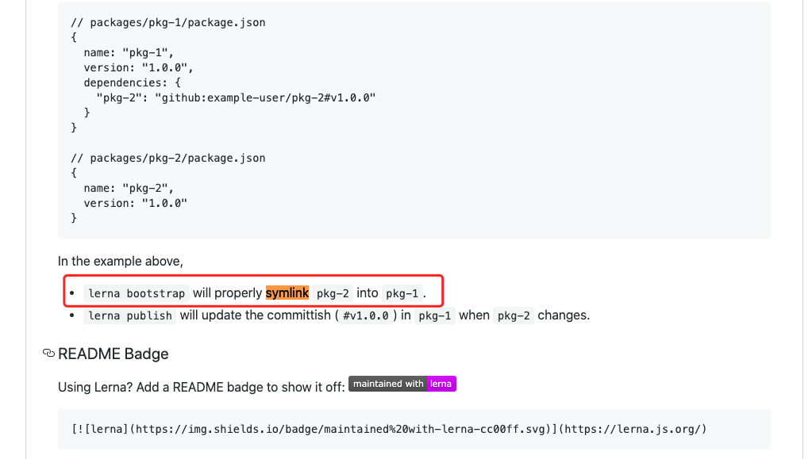
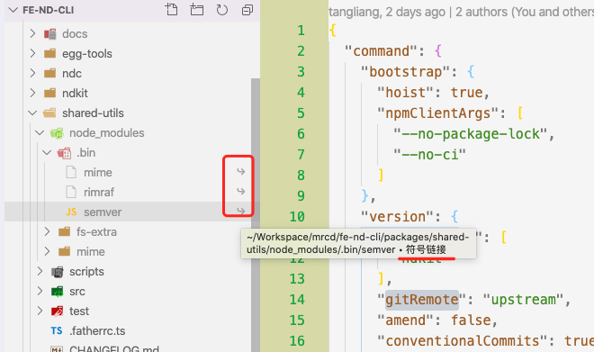
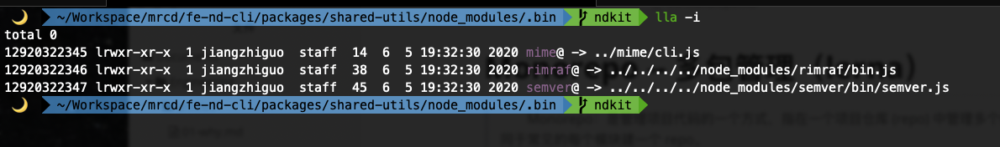
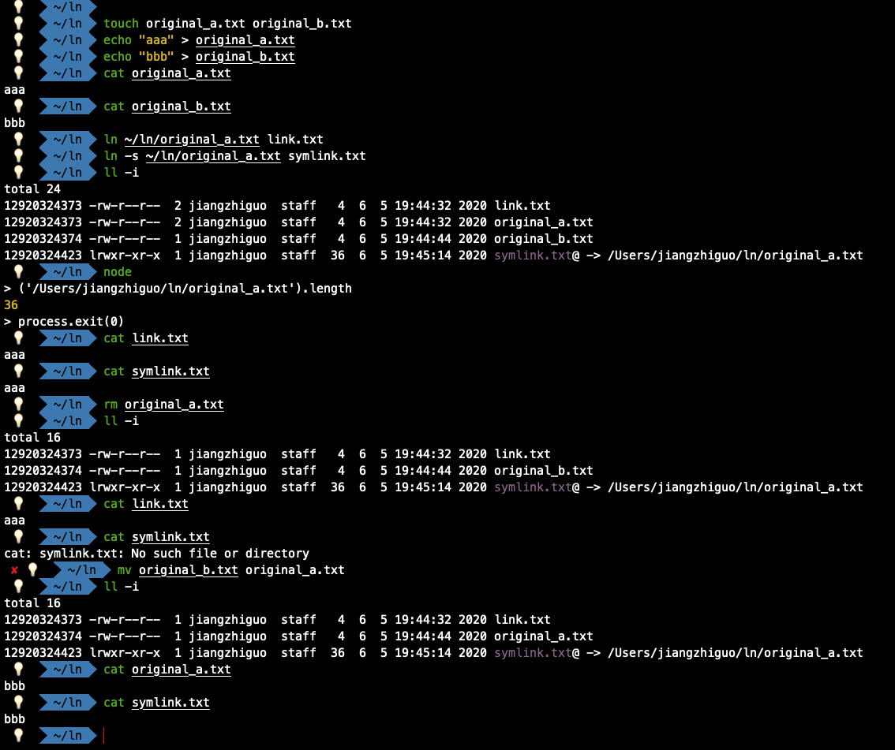

# Monorepo -- 多包管理（lerna）

> Monorepo：是管理项目代码的一个方式，指在一个项目仓库 (repo) 中管理多个模块/包 (package)，不同于常见的每个模块建一个 repo。

先来看看 多 Git Repo 的缺点：

- **调试不方便**：
  - 对于功能类似的模块，如果拆成了多个仓库，无论对于多人协作还是独立开发，都需要打开多个仓库页面。
  - 对于共用的包通过 Npm 安装，如果不能接受调试编译后的代码，或每次 npm link 一下，就没有办法调试依赖的子包。
- **依赖关系复杂**：
  - 独立仓库间版本号的维护需要手动操作，因为源代码不在一起，所以没有办法整体分析依赖，自动化管理版本号的依赖。
- **三方依赖版本不一致**：
  - 每个独立的包拥有一套独立的开发环境，难以保证子模块的版本和主项目完全一直，就存在运行结果不一致的风险。
- **占用总空间大**：
  - 浪费了大量存储空间重复安装，比如 React 等大型模块
- 。。。

一个理想的开发环境:

​ “只关心业务代码，可以直接跨业务复用而不关心复用方式，调试时所有代码都在源码中。”

在前端开发环境中，多 Git Repo，多 Npm 则是这个理想的阻力，它们导致复用要关心版本号，调试需要 Npm Link。

## 知名度较高的 monorepo 工具 -- lerna

> [Lerna](https://lerna.js.org/)：是一个管理多个 npm 模块的工具，是 Babel 自己用来维护自己的 Monorepo 并开源出的一个项目。优化维护多包的工作流，解决多个包互相依赖，且发布需要手动维护多个包的问题。

最佳实践是 lerna + yarn 进行 多包管理

### 使用步骤

### 1. 全局安装 `lerna` 和 `yarn`

```shell
$ npm i -g lerna yarn
```

### 2. 初始化项目

```shell
$ mkdir ndkit && cd ndkit

$ lerna init

$ tree -a -C --dirsfirst -L 3 -I 'node_modules|.git'
.
├── packages
├── lerna.json
└── package.json
```

### 3. 添加 yarn workspace

#### (1) package.json

```json
{
  ...
  "name": "root",
  /* 项目根目录下的private必须设置成true，否则workspace不会被启用 */
  "private": true,
  /* 指定需要管理的模块，这里的包组织方式参考的vuepress */
  "workspaces": [
    /* 所有模块包在此文件夹下 */
    "packages/*",
  ]
  ...
}
```

#### (2) lerna.json

```json
{
  ...
  /* [doc](https://github.com/lerna/lerna/tree/master/commands) */
  "command": {
    "bootstrap": {
      /* 此模式：当多个包有相同依赖时会提升到顶层的node_modules，避免重复安装，减少体积 */
      "hoist": true,
      /* 在bootstrap期间，将参数传递给 npm install */
      "npmClientArgs": ["--no-package-lock", "--no-ci"]
    },
    "version": {
      "allowBranch": ["master"],
      /* 开启的话，提交当前所有更改，而不是添加新的提交，会跳过 `git commit`、`git push` */
      "amend": false,
      /* 自动生成changelog.md，详情请看[约定式提交](https://www.conventionalcommits.org/zh-hans/v1.0.0-beta.4/) */
      "conventionalCommits": true
    },
    "publish": {
      /* 跳过npm包访问权限 */
      "verifyAccess": false,
      /* 发布地址 */
      "registry": "http://npm.xxx.org"
    }
  },
  /* 使用yarn运行所有命令 */
  "npmClient": "yarn",
  /* 使用yarn的工作区（需在package.json中指定workspaces） */
  "useWorkspaces": true,
  /* 独立模式：该模式下只有改动过的 package 才会被发布,每次发布时，都会提示您已更改的每个软件包，以指定是补丁，次要，主要还是自定义更改，注意：使用约定式提交后，会根据commit生成对应版本，无需手动指定 */
  "version": "0.0.0"
  ...
}
```

### 4. 添加模块

```shell
$ tree -a -C --dirsfirst -L 3 -I 'node_modules|.git|package-lock.json'
./packages
├── @ndkit
│   ├── core
│   ├── egg-tools
│   ├── ndkit
│   └── shared-utils
└── docs
    ├── cmds
    ├── utils
    ├── cli.js
    ├── index.js
    └── package.json
# 查看所有package，注意 package.json 中若设置了"private": true，则不会展示
$ lerna ls
info cli using local version of lerna
lerna notice cli v3.19.0
lerna info versioning independent
@ndkit/core
@ndkit/egg-tools
@ndkit/ndkit
@ndkit/shared-utils
lerna success found 4 packages
```

注意：这里 lerna 取到的模块名是来自 `package.json` 的 `name` 属性

### 5. 安装相关依赖(四种)

#### （1） 安装所有依赖（bootstrap）

```shell
# --npm-client=yarn --hoist 会冲突
# 用 yarn workspace 特性替代 lerna bootstrap
$ yarn
```

#### （2）根项目安装依赖

```shell
# yarn 使用 workspace 模式安装 npm 包时必须加 -W 参数
$ yarn add -D -W [...pkg]
```

#### （3）给 package 安装外部依赖

```shell
$ yarn workspace @ndkit/share-utils add chalk debug globby fs-extra mime
```

#### （4）给 package 安装内部依赖

```shell
# 一定要指定正确的版本号，不然会到npm查找包
$ yarn workspace @ndkit/egg-tools add @ndkit/shared-utils@^1.0.0
```

### 6. 清除依赖

```shell
$ lerna clean && rm -rf ./node_modules
```

### 7. 运行命令

```shell
# lerna run [...cmd] --scope @scope
$ lerna run compile --scope @ndkit/shared-utils
```

### 8. 发布

```shell
# 查看更改，同样 package.json 中设置了 "private": true 的 package 不会展示
$ lerna changed
# 每次发布会自动更新相关package的版本号，并且会更新引用该package的其他package依赖
$ lerna publish
```

### 总结需要注意的点：

1. lerna 会忽略私有项目，也就是 `package.json` 中 的 设置了 `“private”: true`
2. 根项目安装依赖需加 W 参数：`yarn add -W [...pkg]`
3. 安装内部依赖需要加版本号：`yarn workspace add @ndkit/shared-utils@^1.0.0`
4. `lerna.json` 配置基本都都可以在官方仓库找到，例如：version 对应 <https://github.com/lerna/lerna/blob/master/commands/version/README.md>
5. `"conventionalCommits": true` 开启后表示提交采用约定式提交：<https://www.conventionalcommits.org/zh-hans/v1.0.0-beta.4/>
6. 提交一定要按规范，包更新一定要指定 scope
7. 如果是私有仓库，可配置 `publish.registry`，如果是关联的远程仓库，可配置 `version.gitRemote`
8. 安装私有包需要配置源:
   1. `npm set [scope]:registry [url]`
   2. `yarn config [scope]:registry [url]`
   3. `nrm add [scope] url`, `nrm use ndog`
9. ...
10. 边用边补充吧。

---

以上是简单使用，那么 `lerna` 是怎么实现的，它的原理是什么，其实官方 readme 已经体现出来了



可以看到是 node 的 `fs.symlink` <http://nodejs.cn/api/fs.html#fs_fs_symlink_target_path_type_callback>

虽然这是一个更通用的解决方案，但会导致在子模块目录仍然存在 `node_modules` 文件夹，而且效果依赖项目初始化命令。





一般替代方式是别名映射 alias

对比一下：

- symlink: 更通用，适合任何构建器。但需要初始化，且在每个关联模块下新增 `node_modules` 文件夹。
- alias: 限定构建器。但不需要初始化，不新增文件夹，甚至可以运行时动态修改别名配置。

那么目录结构有可能是这样：

```shell
.
├── packages
│      ├─ module-a
│      │    ├─ src            # 模块 a 的源码
│      │    └─ package.json   # 自动生成的，仅模块 a 的依赖
│      └─ module-b
│           ├─ src            # 模块 b 的源码
│           └─ package.json   # 自动生成的，仅模块 b 的依赖
├── tsconfig.json             # 配置文件，对整个项目生效
├── .eslintrc                 # 配置文件，对整个项目生效
├── node_modules              # 整个项目只有一个外层 node_modules
└── package.json              # 包含整个项目所有依赖
```

所有全局配置文件只有一个，这样不会导致 IDE 遇到子文件夹中的配置文件，导致全局配置失效或异常。`node_modules` 也只有一个，既保证了项目依赖的一致性，又避免了依赖被重复安装，节省空间的同时还提高了安装速度。

**兄弟模块之间通过模块 `package.json` 定义的 `name` 相互引用，保证模块之间的独立性，但又不需要真正发布或安装这个模块，通过 `tsconfig.json` 的 `paths` 与 `webpack` 的 `alias` 共同实现虚拟模块路径的效果。**

---

扩展知识点：

链接：分为硬链接和软链接（也叫符号链接）两种。硬链接是对一个文件（Inode）起不同的名字（包含目录）；软链接是对一个文件的间接指针，相当于 windows 下的快捷方式；

#### 硬链接

- 不能对目录文件做硬链接。
- 不能在不同的文件系统之间做硬链接。就是说，链接文件和被链接文件必须位于同一个文件系统中

#### 软链接

- 删除源文件或目录，只删除了数据，不会删除链接。一旦以同样文件名创建了源文件，链接将继续指向该文件的新数据。
- 在目录长列表中，符号链接作为一种特殊的文件类型显示出来，其第一个字母是 l。
- 软链接的大小是其链接文件的路径名中的字节数。
- 有一个箭头指向源文件或目录


