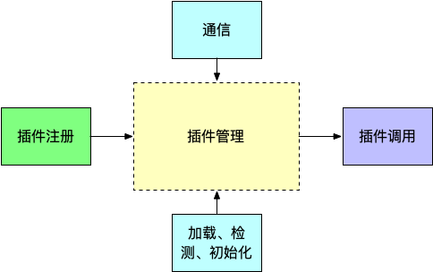
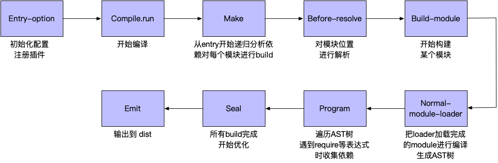
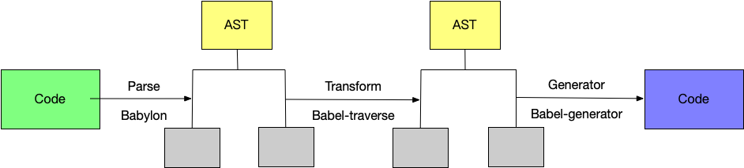
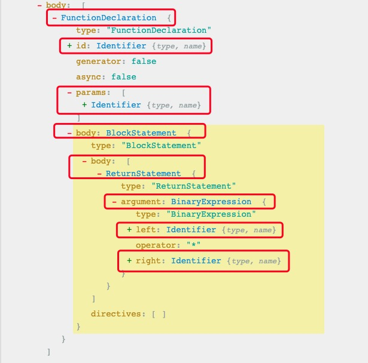
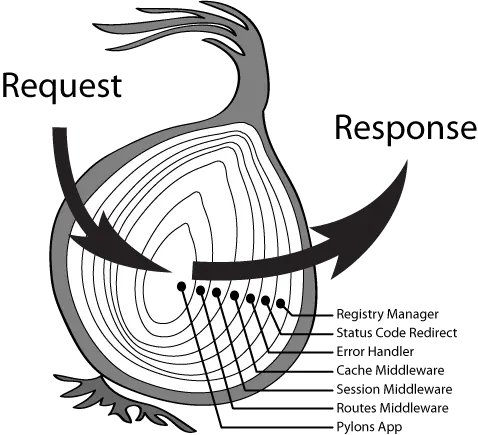

# 插件化思维

> 插件化思维是一种极客精神, 大量可拓展、需要协同开发的程序都离不开插件机制的支撑. 可以说插件无处不在, koa、egg、umi、vscode、webpack. . . . . .



没有插件化, 核心库的代码会变得十分冗余, 功能耦合越来越严重, 最后就导致维护困难

通常插件化都是从设计模式演化而来的, 大概可以参考的有：命令模式, 工厂模式, 抽象工厂模式等等

插件的形式一般有:

- **约定/注入插件化**: 按照约定设计插件,以 入口文件/指定文件名(json/js/ts) 作为插件入口,按约定返回就会被加载, 并可以拿到一些上下文 (`gulp`、`webpack`、`babel`)
- **事件插件化**: 通过事件的方式提供插件开发的能力 (`dom events`、`koa`)
- **插槽插件化**: 一般用在对 UI 元素的拓展 (`gaea-editor`)

下面简单分析一下 `webpack`、`babel`、`koa` 和 `dom events` 的插件形式

## webpack

> 一个插件式的打包框架, 他的功能基本都是通过插件实现的



大概流程(主线):

- 把 `options` 配置转化成内部插件, 注册插件
- 调用 `compile.run` 进入编译阶段, 他会注册好不同类型的 `module` 对应的 `factory`
- 进入 `make` 阶段
- 第一步是 对模块位置进行解析,调用 `loader` 进行编译, 生成AST树
- 第二步是 遍历AST树, 收集依赖, 每个模块都会记录自己的依赖关系, 从而形成一颗关系树
- 调用 `compilation.seal` 进入 `render` 阶段, 根据之前收集的依赖, 决定生成多少文件, 每个文件的内容是什么
- 最后输出到 `dist`

插件相关:

- 注册阶段, 每个插件会在自己需要的生命周期上注册自己的回调
- 编译阶段, `webpack` 会把编译过程分为很多个生命周期, 在编译启动后, 会通过 `hooks[name]` 各个生命周期中调用对应的回调函数

### 插件接口:

```js
class MyPlugin {
  apply = (compiler)=>{
    compiler.hooks.someHook.tap('MyPlugin', (params) => {
      /* ... */
    });
  }
}
```

这里的 `someHook` 是[生命周期钩子函数](https://webpack.docschina.org/api/compiler-hooks/#hooks)

### 注册使用:

```js
module.exports = {
  /* ... */
  plugins: [
    /* ... */
    new MyPlugin(), // 他的调用取决于内部钩子,和这里的顺序无关
  ],
  /* ... */
}
```

## babel

> Babel 是一个编译器（输入源码 => 输出编译后的代码）,编译过程分为三个阶段：解析、转换和打印输出



[更详细的手册](https://github.com/thejameskyle/babel-handbook)

### 注册

```json
{
  // 顺序执行
  "plugins": ["transform-decorators-legacy", "transform-class-properties"],
  // 倒序执行, 本质是插件集
  "presets": ["es2015", "react", "stage-2"]
}
```

### 具体实现

> [visitors 模式](https://zh.wikipedia.org/wiki/%E8%AE%BF%E9%97%AE%E8%80%85%E6%A8%A1%E5%BC%8F)



```js
function square(n) {
  return n * n;
}
⬇⬇⬇
- FunctionDeclaration
  - Identifier (id)
  - Identifier (params[0])
  - BlockStatement (body)
    - ReturnStatement (body)
      - BinaryExpression (argument)
        - Identifier (left)
        - Identifier (right)
```

访问过程: (深度优先遍历整个 AST, 插件只要声明不同节点做啥操作就行)

- 进入 `FunctionDeclaration`
  - 进入 `Identifier (id)`
  - 走到尽头
  - 退出 `Identifier (id)`
  - 进入 `Identifier (params[0])`
  - 走到尽头
  - 退出 `Identifier (params[0])`
  - 进入 `BlockStatement (body)`
  - 进入 `ReturnStatement (body)`
    - 进入 `BinaryExpression (argument)`
    - 进入 `Identifier (left)`
      - 走到尽头
    - 退出 `Identifier (left)`
    - 进入 `Identifier (right)`
      - 走到尽头
    - 退出 `Identifier (right)`
    - 退出 `BinaryExpression (argument)`
  - 退出 `ReturnStatement (body)`
  - 退出 `BlockStatement (body)`
- 退出 `FunctionDeclaration`

特点是 当创建访问者时你实际上有两次机会来访问一个节点

## koa

> 洋葱模型 (`umi-request` 也是参考的这个)



对应这张图来看, 洋葱的每一个圈就是一个中间件, 它即可以掌管请求进入, 也可以掌管响应返回

本质上都是高阶函数的嵌套, 外层的中间件嵌套着内层的中间件, 这种机制的好处是可以自己控制中间件的能力（外层的中间件可以影响内层的请求和响应阶段, 内层的中间件只能影响外层的响应阶段）

```js
const Koa = require('koa');
const app = new Koa();

// 在 koa 中, 要应用一个中间件, 我们使用 app.use()
// middlewares
app.use(session({
    key: config.session.secret,
    maxAge: config.session.maxAge,
    store: new SessionStore()
}));
app.use(koaBody({multipart:true}));
app.use(json());
app.use(httplogger());
```

先来看一下这个 [`use`](https://github.com/koajs/koa/blob/master/lib/application.js#L122):

```js
use(fn) {
  if (typeof fn !== 'function') throw new TypeError('middleware must be a function!');
  if (isGeneratorFunction(fn)) {
    deprecate('Support for generators will be removed in v3. ' +
              'See the documentation for examples of how to convert old middleware ' +
              'https://github.com/koajs/koa/blob/master/docs/migration.md');
    fn = convert(fn);
  }
  debug('use %s', fn._name || fn.name || '-');
  this.middleware.push(fn);
  return this;
}
```

可以看到:

- `isGeneratorFunction` 做了 `Generator` 做了兼容,判断并转换
- `use` 的参数(函数/中间件) 都推入 数组(栈) `middleware` 中

然后找 `this.middleware`, 可以看到是 [`callback`](https://github.com/koajs/koa/blob/master/lib/application.js#L143) 这个方法里调用了

```js
callback() {
  const fn = compose(this.middleware);

  if (!this.listenerCount('error')) this.on('error', this.onerror);

  const handleRequest = (req, res) => {
    const ctx = this.createContext(req, res);
    return this.handleRequest(ctx, fn);
  };

  return handleRequest;
}
```

可以看到, 主要是 [`compose`](https://github.com/koajs/compose/blob/master/index.js#L23) 这个方法,

```js
/**
 * Compose `middleware` returning
 * a fully valid middleware comprised
 * of all those which are passed.
 *
 * @param {Array} middleware
 * @return {Function}
 * @api public
 */
function compose (middleware) {
  if (!Array.isArray(middleware)) throw new TypeError('Middleware stack must be an array!')
  middleware = flatten(middleware)
  for (const fn of middleware) {
    if (typeof fn !== 'function') throw new TypeError('Middleware must be composed of functions!')
  }

  /**
   * @param {Object} context
   * @return {Promise}
   * @api public
   */

  return function (context, next) {
    // last called middleware #
    let index = -1
    return dispatch(0)
    function dispatch (i) {
      if (i <= index) return Promise.reject(new Error('next() called multiple times'))
      index = i
      let fn = middleware[i]
      if (i === middleware.length) fn = next
      if (!fn) return Promise.resolve()
      try {
        return Promise.resolve(fn(context, dispatch.bind(null, i + 1)));
      } catch (err) {
        return Promise.reject(err)
      }
    }
  }
}
```

可以看到 compose() 返回一个匿名函数的结果, 该匿名函数自执行了 dispatch() 这个函数, 并传入了0作为参数

`dispatch(i)`

- `i` 是当前中间件的下标
- `i <= index` 抛出错误: `next()` 方法调用多次
- `index = i`, 将当前的 `i` 赋值给 `index, 记录当前执行中间件的下标, 并对` `fn` 进行赋值, 获得中间件
- `fn(context, dispatch.bind(null, i + 1))`, 执行中间件 `fn`,
  - `context` 是 `koa` 中的上下文对象
  - `dispatch(i+1)` 是执行结果, `i+1` 执行了下一个中间件, 形成递归调用
- `Promise.resolve` 将普通函数 `Promise` 化

这里的第二个参数就是我们常用的 `next()`, 只有执行了 `next` 函数, 才能正确得执行下一个中间件

因此每个中间件只能执行一次 next, 如果在一个中间件内多次执行 next, 就会出现问题, 所以要通过 `i<=index` 判断 `next` 执行多次

因为正常情况下 `index` 必定会小于等于 `i`, 如果在一个中间件中调用多次 `next`, 会导致多次执行 `dispatch(i+1)`, 从代码上来看, 每个中间件都有属于自己的一个闭包作用域, 同一个中间件的 `i` 是不变的, 而 `index` 是在闭包作用域外面的

当第一个中间件即 `dispatch(0)` 的 `next()` 调用时, 此时应该是执行 `dispatch(1)`, 在执行到下面这个判断的时候

```js
if (i <= index) return Promise.reject(new Error('next() called multiple times'))
```

此时的 `index` 的值是 0, 而 `i` 的值是1, 不满足 `i<=index` 这个条件, 继续执行下面的 `index=i` 的赋值, 此时 `index` 的值为1, 但是如果第一个中间件内部又多执行了一次 `next()`的话, 此时又会执行 `dispatch(2)`. 又因为同一个中间件内的 `i` 的值是不变的, 所以此时 `i` 的值依然是1, 所以导致了 `i <= index` 的情况.

中间件基本格式:

```js
async function koaMiddleware(ctx, next){
  try{
    // do something
    await next()
    // do something
  }
  .catch(err){
    // handle err
  }
}
```

执行流程:

- 先执行第一个中间件(`dispatch(0)`), 返回 `Promise`, 然后被 `Koa` 监听, 执行对应的逻辑（成功或失败）
- 在执行第一个中间件的逻辑时, 遇到 `await next()`时, 会继续执行 `dispatch(i+1)`, 也就是执行 `dispatch(1)`, 会手动触发执行第二个中间件. 这时候, 第一个中间件 `await next()` 后面的代码就会被 `pending`, 等待 `await next()` 返回 `Promise`, 才会继续执行第一个中间件 `await next()` 后面的代码
- 同样的在执行第二个中间件的时候, 遇到 `await next()` 的时候, 会手动执行第三个中间件, `await next()` 后面的代码依然被 `pending`, 等待 `await` 下一个中间件的 `Promise.resolve`. 只有在接收到第三个中间件的 `resolve` 后才会执行后面的代码, 然后第二个中间会返回 `Promise`, 被第一个中间件的 `await` 捕获, 这时候才会执行第一个中间件的后续代码, 然后再返回 `Promise`
- 以此类推, 如果有多个中间件的时候, 会依照上面的逻辑不断执行, 先执行第一个中间件, 在 `await next()` 出 `pending`, 继续执行第二个中间件, 继续在 `await next()` 出 `pending`, 继续执行第三个中间, 直到最后一个中间件执行完, 然后返回 `Promise`, `然后倒数第二个中间件才执行后续的代码并返回Promise`, 然后是倒数第三个中间件, 接着一直以这种方式执行直到第一个中间件执行完, 并返回 `Promise`, 从而实现洋葱图的执行顺序

## dom events

```js
document.on('click', callback);
```

- 可拓展：可以重复定义 N 个 focus 事件相互独立
- 事件相互独立：每个 callback 之间互相不受影响

事件机制就是在一些阶段放出钩子，允许用户代码拓展整体框架的生命周期

## 总结

插件机制是灵活多变的, 非定式的, 她取决于你编写的框架想要解决什么问题, 想给用户什么样的自由度
