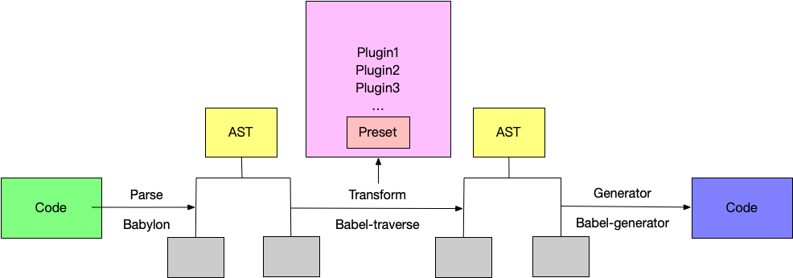

# 插件化思维

> 插件化思维是一种极客精神，大量可拓展、需要协同开发的程序都离不开插件机制的支撑。可以说插件无处不在，koa、egg、umi、vscode、webpack。。。。。。


没有插件化，核心库的代码会变得十分冗余，功能耦合越来越严重，最后就导致维护困难

通常插件化都是从设计模式演化而来的, 大概可以参考的有：命令模式，工厂模式，抽象工厂模式等等

插件的形式一般有:

- **约定/注入插件化**: 按照约定设计插件,以 入口文件/指定文件名(json/js/ts) 作为插件入口,按约定返回就会被加载，并可以拿到一些上下文 (`gulp`、`webpack`、`babel`)
- **事件插件化**: 通过事件的方式提供插件开发的能力 (`dom events`、`koa`)
- **插槽插件化**: 一般用在对 UI 元素的拓展 (`gaea-editor`)

## webpack

### 插件接口:

```js
class MyPlugin {
  apply = (compiler)=>{
    compiler.hooks.someHook.tap('MyPlugin', (params) => {
      /* ... */
    });
  }
}
```

这里的 `someHook` 是[生命周期钩子函数](https://webpack.docschina.org/api/compiler-hooks/#hooks)

### 注册使用:

```js
module.exports = {
  /* ... */
  plugins: [
    /* ... */
    new MyPlugin(),
  ],
  /* ... */
}
```

## babel

> Babel 是一个编译器（输入源码 => 输出编译后的代码）,编译过程分为三个阶段：解析、转换和打印输出



[手册](https://github.com/thejameskyle/babel-handbook)

### 注册

```json
{
  // 顺序执行
  "plugins": ["transform-decorators-legacy", "transform-class-properties"],
  // 倒序执行
  "presets": ["es2015", "react", "stage-2"]
}
```

### 具体实现

> visitor 模式

## koa

> 洋葱模型
