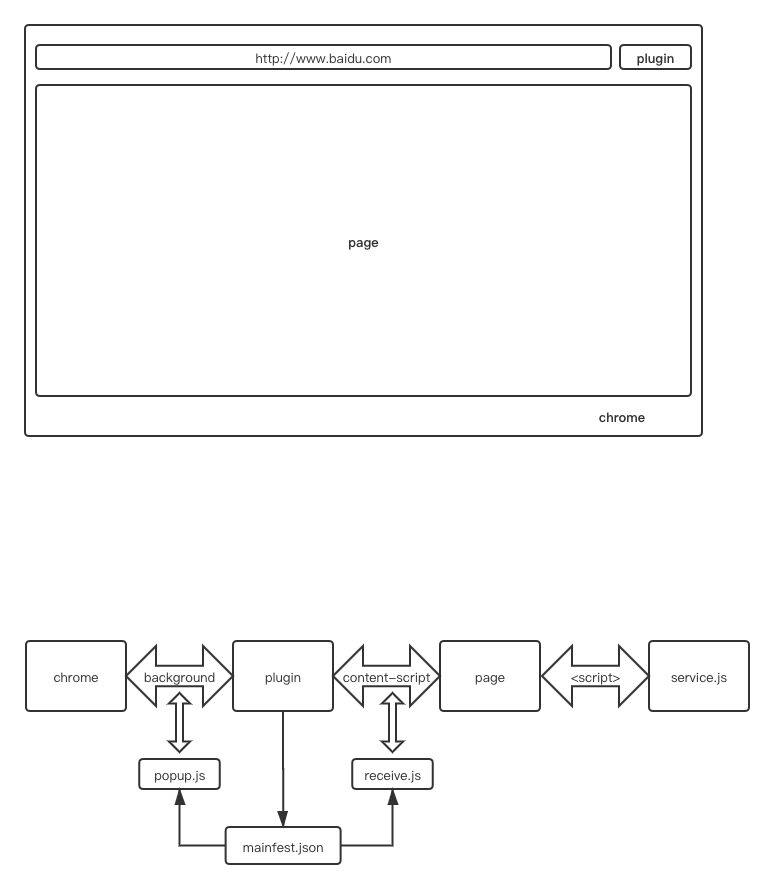

### 扩展简介

Chrome扩展是一个用Web技术开发、用来增强浏览器功能的软件，它其实就是一个由HTML、CSS、JS、图片等资源组成的一个.crx后缀的压缩包.

### 浏览器、扩展及视窗关系



从上图可以看出，扩展和页面间的关系是通过DOM维系的，即扩展无法直接与页面中的js直接关联。

扩展可以调用很多web无法调用的浏览器功能。比如：
  书签控制；
  下载控制；
  窗口控制；
  标签控制；
  网络请求控制，各类事件监听；
  自定义原生菜单；
  完善的通信机制；

### 扩展的核心manifest.json

manifest.json的作用跟package.json很像，是项目的核心文件。在其中包括了对扩展的版本描述的相关字段，还有对权限、资源引入有明确的分配。

1、背景页配置

```js
  "background":
 {
  // 2种指定方式，如果指定JS，那么会自动生成一个背景页
  "page": "background.html"
  //"scripts": ["js/background.js"]
 },
```

2、content-script配置

```js
"content_scripts":
 [
  {
   //"matches": ["http://*/*", "https://*/*"],
   // "<all_urls>" 表示匹配所有地址
   "matches": ["<all_urls>"],
   // 多个JS按顺序注入
   "js": ["js/jquery-1.8.3.js", "js/content-script.js"],
   // JS的注入可以随便一点，但是CSS的注意就要千万小心了，因为一不小心就可能影响全局样式
   "css": ["css/custom.css"],
   // 代码注入的时间，可选值： "document_start", "document_end", or "document_idle"，最后一个表示页面空闲时，默认document_idle
   "run_at": "document_start"
  },
 ],
```

### 插件常见设计思路

1、按照官方特定设计。
有background页面，有popup页面，有资源文件，全部打包到crx中。
优点：加载资源快
缺点：更新频繁时需要上传，类似app上线

2、将主要的通信方法和初始化方法抽出，打包到crx中，其余文件上传到服务器。
优点：更新响应快，核心功能不变的情况下，调整迅速
缺点：如果安全策略发生变化，可能第三方引入的方式失效，且加载慢，受网络环境影响
