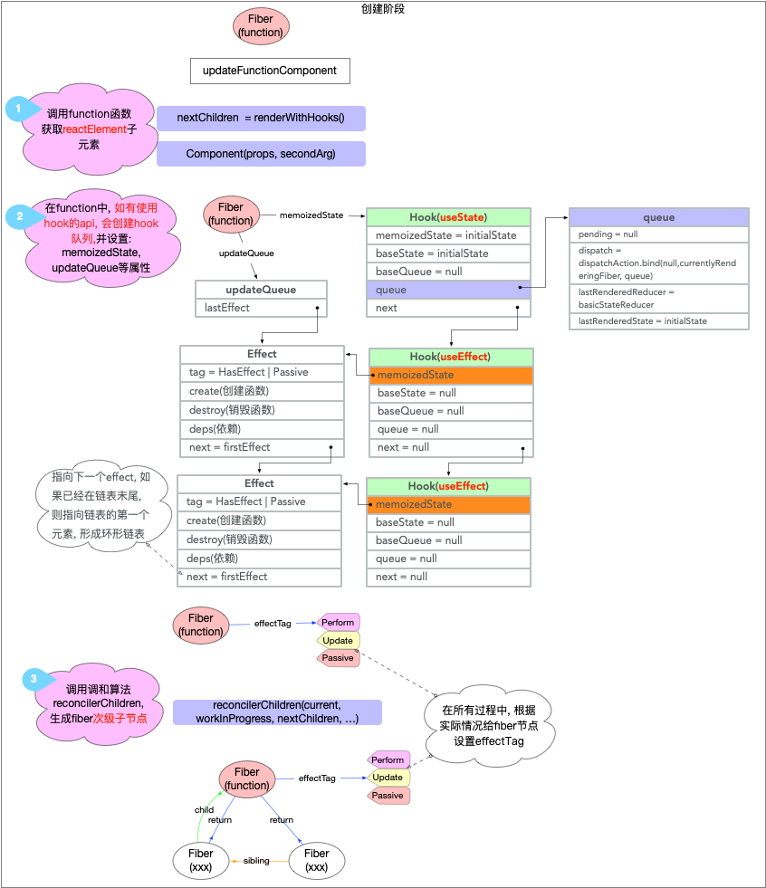
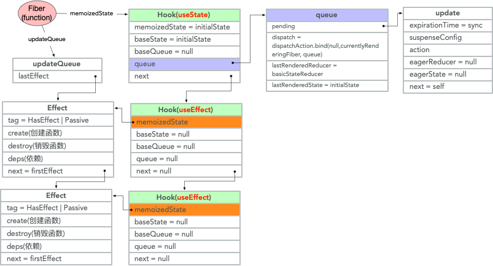
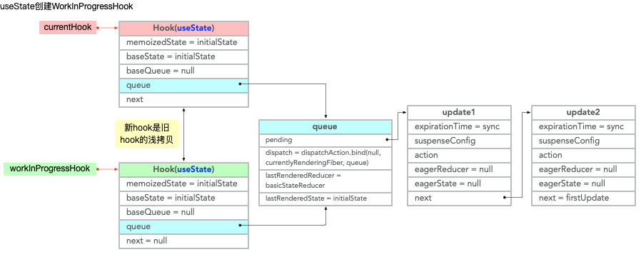
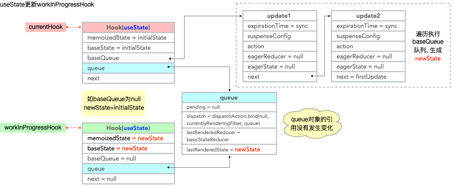
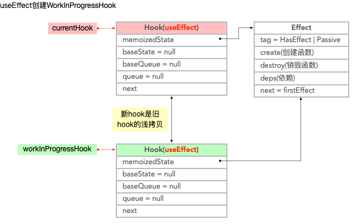
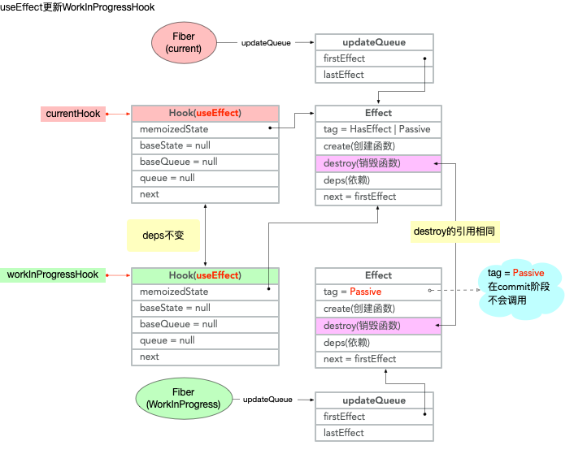
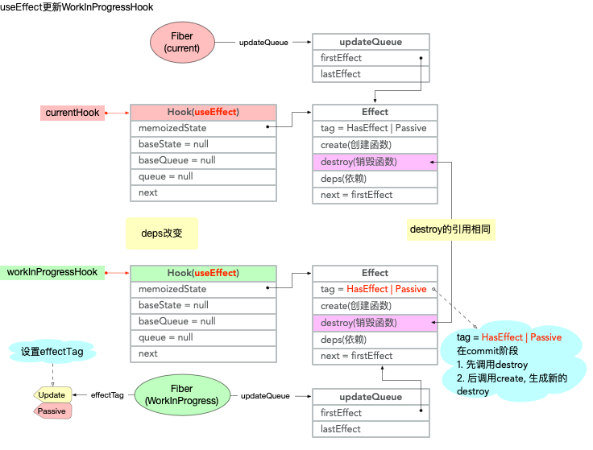
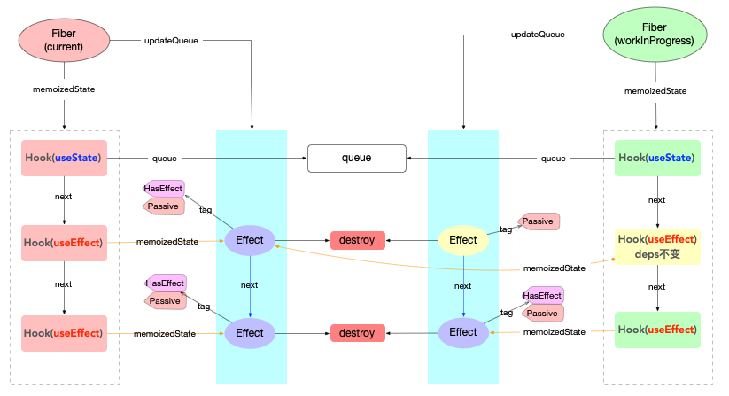

# hook 原理

首先引入官网上对[hook 的解释](https://zh-hans.reactjs.org/docs/hooks-intro.html).

1. `hook`只能用于`function`中
2. 可以使用`state`以及其他的`React`特性

演示代码:

```jsx
import React, { useState, useEffect } from 'react'
function Example() {
  Promise.resolve().then(() => {
    console.log(
      '所有的effect.create都是通过调度器(scheduler)异步(MessageChannel)执行的, 故effect.create函数必然在此之后执行',
    )
  })
  // 第1个hook(useState)
  const [count, setCount] = useState(0)
  // 第2个hook(useEffect)
  useEffect(() => {
    console.log('第1个effect.create dps: []')
    return () => {
      console.log('第1个effect.destory')
    }
  }, [])
  // 第3个hook(useEffect)
  useEffect(() => {
    console.log('effect.create dps: [count]', count)
    return () => {
      console.log('第2个effect.destory dps: [count]', count)
    }
  }, [count])
  return (
    <>
      <p>You clicked {count} times</p>
      <button onClick={() => setCount(count + 1)}>Click me</button>
    </>
  )
}
export default Example
```

## 新增阶段

### 创建 fiber

通过[首次 render](./03-render-process.md#beginWork)中的介绍, 创建节点都是在`beginWork`阶段.

`function`类型节点在新增时调用`mountIndeterminateComponent`

```js
// 省略了与创建fiber无关的逻辑
function mountIndeterminateComponent(_current, workInProgress, Component, renderExpirationTime) {
  const props = workInProgress.pendingProps
  let value
  value = renderWithHooks(null, workInProgress, Component, props, context, renderExpirationTime)
  // React DevTools reads this flag.
  workInProgress.effectTag |= PerformedWork
  // Proceed under the assumption that this is a function component
  workInProgress.tag = FunctionComponent
  reconcileChildren(null, workInProgress, value, renderExpirationTime)
  return workInProgress.child
}
```

核心步骤:

1. 调用`renderWithHooks`(目的和调用`classInstance.render`一样),返回代表子节点的`reactElement`
2. 将步骤 1 中得到的`reactElement`传入`reconcileChildren`中去构建`fiber`次级子节点

逻辑进入`ReactFiberHooks`中, 这是一个独立的工作空间, 管理所有的`hook`对象.

```js
export function renderWithHooks<Props, SecondArg>(
  current: Fiber | null,
  workInProgress: Fiber,
  Component: (p: Props, arg: SecondArg) => any,
  props: Props,
  secondArg: SecondArg,
  nextRenderExpirationTime: ExpirationTime,
): any {
  renderExpirationTime = nextRenderExpirationTime
  currentlyRenderingFiber = workInProgress

  workInProgress.memoizedState = null
  workInProgress.updateQueue = null
  workInProgress.expirationTime = NoWork

  // 1.设置全局HooksDispatcher
  ReactCurrentDispatcher.current =
    current === null || current.memoizedState === null ? HooksDispatcherOnMount : HooksDispatcherOnUpdate
  // 2.执行`Component`
  let children = Component(props, secondArg)

  renderExpirationTime = NoWork
  currentlyRenderingFiber = (null: any)
  currentHook = null
  workInProgressHook = null
  didScheduleRenderPhaseUpdate = false
  return children
}
```

核心步骤:

1. 设置当前`hook`操作代理`ReactCurrentDispatcher`
   - 新增节点, 设置为`HooksDispatcherOnMount`
   - 更新节点, 设置为`HooksDispatcherOnUpdate`
2. 执行`Component()`

### 创建 hook

在执行`Example()`的时候, 调用`useState(0)`

跟进`useState`逻辑, 最终执行`ReactCurrentDispatcher.current.useState(initialState)`.

新增节点, `useState`对应`mountState`

```js
function mountState<S>(initialState: (() => S) | S): [S, Dispatch<BasicStateAction<S>>] {
  //1. 创建hook对象, 并且挂载到当前`fiber.memoizedState`上,workInProgressHook指向当前hook
  const hook = mountWorkInProgressHook()
  if (typeof initialState === 'function') {
    // $FlowFixMe: Flow doesn't like mixed types
    initialState = initialState()
  }
  //2. 把initialState设置到`hook`对象中
  hook.memoizedState = hook.baseState = initialState
  //3. 设置hook.queue
  // 设置lastRenderedReducer,lastRenderedState,dispatch
  const queue = (hook.queue = {
    pending: null,
    dispatch: null,
    lastRenderedReducer: basicStateReducer,
    lastRenderedState: (initialState: any),
  })
  // 设置queue.dispatch, 当前fiber被关联到queue.dispatch中
  const dispatch: Dispatch<BasicStateAction<S>> = (queue.dispatch = (dispatchAction.bind(
    null,
    currentlyRenderingFiber,
    queue,
  ): any))
  //4. 返回dispatchAction操作接口
  return [hook.memoizedState, dispatch]
}
```

核心步骤:

1. 创建`hook`对象, 挂载到当前`fiber.memoizedState`,`workInProgressHook`指向此`hook`
2. 设置`hook.queue`, 和当前`fiber`进行关联

新增节点, `useEffect`对应`mountEffect`

```js
function mountEffect(create: () => (() => void) | void, deps: Array<mixed> | void | null): void {
  // 注意这里指定了两种tag
  return mountEffectImpl(
    UpdateEffect | PassiveEffect, // fiber.effectTag 适用于fiber对象
    HookPassive, // effect.tag 适用于effect对象
    create,
    deps,
  )
}

function mountEffectImpl(fiberEffectTag, hookEffectTag, create, deps): void {
  const hook = mountWorkInProgressHook()
  const nextDeps = deps === undefined ? null : deps
  currentlyRenderingFiber.effectTag |= fiberEffectTag
  hook.memoizedState = pushEffect(
    HookHasEffect | hookEffectTag, //再次指定 effect.tag
    create,
    undefined,
    nextDeps,
  )
}

function pushEffect(tag, create, destroy, deps) {
  // 创建新的effect对象
  const effect: Effect = {
    tag,
    create,
    destroy,
    deps,
    // Circular
    next: (null: any),
  }
  // 将effect对象添加到fiber.updateQueue队列中
  let componentUpdateQueue: null | FunctionComponentUpdateQueue = (currentlyRenderingFiber.updateQueue: any)
  if (componentUpdateQueue === null) {
    componentUpdateQueue = createFunctionComponentUpdateQueue()
    currentlyRenderingFiber.updateQueue = (componentUpdateQueue: any)
    componentUpdateQueue.lastEffect = effect.next = effect
  } else {
    const lastEffect = componentUpdateQueue.lastEffect
    if (lastEffect === null) {
      componentUpdateQueue.lastEffect = effect.next = effect
    } else {
      const firstEffect = lastEffect.next
      lastEffect.next = effect
      effect.next = firstEffect
      componentUpdateQueue.lastEffect = effect
    }
  }
  return effect
}
```

核心步骤:

1. 创建`hook`对象, 并且添加到`hook`队列中,`workInProgressHook`指向此`hook`
2. 设置`fiber.effectTag = UpdateEffect | PassiveEffect`
3. 创建`effect`对象(设置`effect.tag = HookHasEffect | HookPassive`), 并将`effect`添加到`fiber.UpdateQueue`队列中

在整个创建`hook`阶段, 主要流程表示如下:



### 执行 hook

从以上流程图可以看到, 执行`function`的时候, 只是创建了`hook`, 但是并没有执行`hook.create`.在首次 render 中有介绍, `commitRoot`分为[3 个阶段](./03-render-process.md#commit阶段)

第一个阶段`commitBeforeMutationEffects`对`Passive`类型的 tag 做了特殊处理.如果`function`类型的`fiber`使用了`hook`api,会设置`fiber.effectTag |= Passive`

```js
function commitBeforeMutationEffects() {
  while (nextEffect !== null) {
    if (
      !shouldFireAfterActiveInstanceBlur &&
      focusedInstanceHandle !== null &&
      isFiberHiddenOrDeletedAndContains(nextEffect, focusedInstanceHandle)
    ) {
      shouldFireAfterActiveInstanceBlur = true
      beforeActiveInstanceBlur()
    }
    const effectTag = nextEffect.effectTag
    // `Passive`类型的tag做了特殊处理.
    if ((effectTag & Passive) !== NoEffect) {
      // If there are passive effects, schedule a callback to flush at
      // the earliest opportunity.
      if (!rootDoesHavePassiveEffects) {
        rootDoesHavePassiveEffects = true
        // 需要注意, 此处的回调函数是通过调度器执行的, 所以是一个异步回调

        scheduleCallback(NormalPriority, () => {
          flushPassiveEffects() // 执行hook的入口
          return null
        })
      }
    }
    nextEffect = nextEffect.nextEffect
  }
}
```

异步回调:

`flushPassiveEffectsImpl -> commitPassiveHookEffects`

```js
export function commitPassiveHookEffects(finishedWork: Fiber): void {
  if ((finishedWork.effectTag & Passive) !== NoEffect) {
    switch (finishedWork.tag) {
      case FunctionComponent:
      case ForwardRef:
      case SimpleMemoComponent:
      case Block:
          commitHookEffectListUnmount(
            HookPassive | HookHasEffect,
            finishedWork,
          );
          commitHookEffectListMount(HookPassive | HookHasEffect, finishedWork);
        break;
      }
      default:
        break;
    }
  }
}
// 执行destroy方法
function commitHookEffectListUnmount(tag: number, finishedWork: Fiber) {
  const updateQueue: FunctionComponentUpdateQueue | null = (finishedWork.updateQueue: any);
  const lastEffect = updateQueue !== null ? updateQueue.lastEffect : null;
  if (lastEffect !== null) {
    const firstEffect = lastEffect.next;
    let effect = firstEffect;
    do {
      if ((effect.tag & tag) === tag) {
        // Unmount
        const destroy = effect.destroy;
        effect.destroy = undefined;
        if (destroy !== undefined) {
          destroy();
        }
      }
      effect = effect.next;
    } while (effect !== firstEffect);
  }
}
// 执行create方法
function commitHookEffectListMount(tag: number, finishedWork: Fiber) {
  const updateQueue: FunctionComponentUpdateQueue | null = (finishedWork.updateQueue: any);
  const lastEffect = updateQueue !== null ? updateQueue.lastEffect : null;
  if (lastEffect !== null) {
    const firstEffect = lastEffect.next;
    let effect = firstEffect;
    do {
      if ((effect.tag & tag) === tag) {
        // Mount
        const create = effect.create;
        effect.destroy = create();
      }
      effect = effect.next;
    } while (effect !== firstEffect);
  }
}
```

## 更新阶段

#### dispatchAction 触发调度

```js
function dispatchAction<S, A>(
  fiber: Fiber,
  queue: UpdateQueue<S, A>,
  action: A,
) {
  // 1. 获取expirationTime
  const currentTime = requestCurrentTimeForUpdate();
  const suspenseConfig = requestCurrentSuspenseConfig();
  const expirationTime = computeExpirationForFiber(
    currentTime,
    fiber,
    suspenseConfig,
  );

  // 2. 创建update对象
  const update: Update<S, A> = {
    expirationTime,
    suspenseConfig,
    action,
    eagerReducer: null,
    eagerState: null,
    next: (null: any),
  };
  //3. 将update对象设置到hook.queue队列当中
  // Append the update to the end of the list.
  const pending = queue.pending;
  if (pending === null) {
    // This is the first update. Create a circular list.
    update.next = update;
  } else {
    update.next = pending.next;
    pending.next = update;
  }
  queue.pending = update;

  const alternate = fiber.alternate;

  //4. 请求调度
  scheduleUpdateOnFiber(fiber, expirationTime);
  }
}
```

`dispatchAction`创建了一个新的`update`对象, 添加到`hook.queue.pending`队列之后.



### 更新 fiber

`scheduleUpdateOnFiber`请求调度, 随后再次构建`fiber`树, `renderWithHooks`作为构建`fiber`树过程中的一环, 也会再次执行.

#### 更新 hook

`renderWithHooks`调用栈中, 执行`Example`函数体, 调用`useState`,`useEffect`等函数重新构造`hook`对象.

> `currentHook`和`workInProgressHook`是两个指针, 分别指向老`hook`和新`hook`

`updateWorkInProgressHook`维护了当前`fiber`节点`新旧hook`指针的移动, 保证`currentHook`和`workInProgressHook`有正确的指向

```js
function updateWorkInProgressHook(): Hook {
  let nextCurrentHook: null | Hook
  // 刚进入该fiber节点, currentHook为null
  if (currentHook === null) {
    // 拿到当前fiber节点的副本(对应老节点)
    const current = currentlyRenderingFiber.alternate
    if (current !== null) {
      nextCurrentHook = current.memoizedState
    } else {
      nextCurrentHook = null
    }
  } else {
    nextCurrentHook = currentHook.next
  }

  let nextWorkInProgressHook: null | Hook
  if (workInProgressHook === null) {
    nextWorkInProgressHook = currentlyRenderingFiber.memoizedState
  } else {
    nextWorkInProgressHook = workInProgressHook.next
  }

  if (nextWorkInProgressHook !== null) {
    // There's already a work-in-progress. Reuse it.
    workInProgressHook = nextWorkInProgressHook
    nextWorkInProgressHook = workInProgressHook.next

    currentHook = nextCurrentHook
  } else {
    // Clone from the current hook.
    currentHook = nextCurrentHook
    // 创建新的hook节点, 最后添加到队列
    const newHook: Hook = {
      memoizedState: currentHook.memoizedState,

      baseState: currentHook.baseState,
      baseQueue: currentHook.baseQueue,
      queue: currentHook.queue,

      next: null,
    }

    if (workInProgressHook === null) {
      // This is the first hook in the list.
      currentlyRenderingFiber.memoizedState = workInProgressHook = newHook
    } else {
      // Append to the end of the list.
      workInProgressHook = workInProgressHook.next = newHook
    }
  }
  return workInProgressHook
}
```

对于`useState`, 调用`updateReducer`:

1. 调用`updateWorkInProgressHook`创建新的`hook`对象
   - 注意新`hook`实际上是旧`hook`的浅拷贝



2. 如果`hook.queue.pending !=== null`
   - 遍历`hook.queue.pending`队列, 提取足够优先级的`update`对象, 生成`newState`
   - 更新`hook`和`queue`对象的相关属性



最后返回新的元组`[hook.memoizedState, dispatch]`

```js
function updateReducer<S, I, A>(reducer: (S, A) => S, initialArg: I, init?: I => S): [S, Dispatch<A>] {
  const hook = updateWorkInProgressHook()
  const queue = hook.queue
  queue.lastRenderedReducer = reducer
  const current: Hook = (currentHook: any)
  // The last rebase update that is NOT part of the base state.
  let baseQueue = current.baseQueue
  // The last pending update that hasn't been processed yet.
  const pendingQueue = queue.pending
  if (pendingQueue !== null) {
    // We have new updates that haven't been processed yet.
    // We'll add them to the base queue.
    if (baseQueue !== null) {
      // Merge the pending queue and the base queue.
      const baseFirst = baseQueue.next
      const pendingFirst = pendingQueue.next
      baseQueue.next = pendingFirst
      pendingQueue.next = baseFirst
    }
    current.baseQueue = baseQueue = pendingQueue
    queue.pending = null
  }

  if (baseQueue !== null) {
    // We have a queue to process.
    const first = baseQueue.next
    let newState = current.baseState

    let newBaseState = null
    let newBaseQueueFirst = null
    let newBaseQueueLast = null
    let update = first
    do {
      const updateExpirationTime = update.expirationTime
      if (updateExpirationTime < renderExpirationTime) {
        // Priority is insufficient. Skip this update. If this is the first
        // skipped update, the previous update/state is the new base
        // update/state.
        const clone: Update<S, A> = {
          expirationTime: update.expirationTime,
          suspenseConfig: update.suspenseConfig,
          action: update.action,
          eagerReducer: update.eagerReducer,
          eagerState: update.eagerState,
          next: (null: any),
        }
        if (newBaseQueueLast === null) {
          newBaseQueueFirst = newBaseQueueLast = clone
          newBaseState = newState
        } else {
          newBaseQueueLast = newBaseQueueLast.next = clone
        }
        // Update the remaining priority in the queue.
        if (updateExpirationTime > currentlyRenderingFiber.expirationTime) {
          currentlyRenderingFiber.expirationTime = updateExpirationTime
          markUnprocessedUpdateTime(updateExpirationTime)
        }
      } else {
        // This update does have sufficient priority.

        if (newBaseQueueLast !== null) {
          const clone: Update<S, A> = {
            expirationTime: Sync, // This update is going to be committed so we never want uncommit it.
            suspenseConfig: update.suspenseConfig,
            action: update.action,
            eagerReducer: update.eagerReducer,
            eagerState: update.eagerState,
            next: (null: any),
          }
          newBaseQueueLast = newBaseQueueLast.next = clone
        }

        // Mark the event time of this update as relevant to this render pass.
        // TODO: This should ideally use the true event time of this update rather than
        // its priority which is a derived and not reverseable value.
        // TODO: We should skip this update if it was already committed but currently
        // we have no way of detecting the difference between a committed and suspended
        // update here.
        markRenderEventTimeAndConfig(updateExpirationTime, update.suspenseConfig)

        // Process this update.
        if (update.eagerReducer === reducer) {
          // If this update was processed eagerly, and its reducer matches the
          // current reducer, we can use the eagerly computed state.
          newState = ((update.eagerState: any): S)
        } else {
          const action = update.action
          newState = reducer(newState, action)
        }
      }
      update = update.next
    } while (update !== null && update !== first)

    if (newBaseQueueLast === null) {
      newBaseState = newState
    } else {
      newBaseQueueLast.next = (newBaseQueueFirst: any)
    }

    // Mark that the fiber performed work, but only if the new state is
    // different from the current state.
    if (!is(newState, hook.memoizedState)) {
      markWorkInProgressReceivedUpdate()
    }

    hook.memoizedState = newState
    hook.baseState = newBaseState
    hook.baseQueue = newBaseQueueLast

    queue.lastRenderedState = newState
  }

  const dispatch: Dispatch<A> = (queue.dispatch: any)
  return [hook.memoizedState, dispatch]
}
```

对于`useEffect`, 调用`updateEffectImpl`:

1. 调用`updateWorkInProgressHook`创建新的`hook`对象
   - 和`useState`中是一致的(不同的是, 通过`useEffect`创建的`hook`对象,`hook.queue = null`)



2. 生成新的`effect`对象

   - hook 更新,并且 deps 依赖不变.

     - 生成新的`effect(HookPassive)`,添加到`fiber.updateQueue`

     

   - deps 依赖改变.

     - 设置`fier.effectTag = UpdateEffect | PassiveEffect`
     - 生成新的`effect(HookHasEffect | HookPassive)`,添加到`fiber.updateQueue`

     

```js
function updateEffectImpl(fiberEffectTag, hookEffectTag, create, deps): void {
  const hook = updateWorkInProgressHook()
  const nextDeps = deps === undefined ? null : deps
  let destroy = undefined
  if (currentHook !== null) {
    // hook更新
    const prevEffect = currentHook.memoizedState
    destroy = prevEffect.destroy
    if (nextDeps !== null) {
      const prevDeps = prevEffect.deps
      if (areHookInputsEqual(nextDeps, prevDeps)) {
        // deps依赖一致
        pushEffect(hookEffectTag, create, destroy, nextDeps)
        return
      }
    }
  }
  // 新增hook, 或者deps依赖改变
  // 1. 设置fier.effectTag = UpdateEffect | PassiveEffect
  currentlyRenderingFiber.effectTag |= fiberEffectTag
  // 2. 设置hook.memoizedState
  hook.memoizedState = pushEffect(HookHasEffect | hookEffectTag, create, destroy, nextDeps)
}
```

整个`hook`的更新过程可以如下表示:

左边是`current`右边是`workInProgress`



注意浅蓝色背景的`updateQueue`队列中, 新`effect`会引用旧`effect`对象的`destroy`方法.
