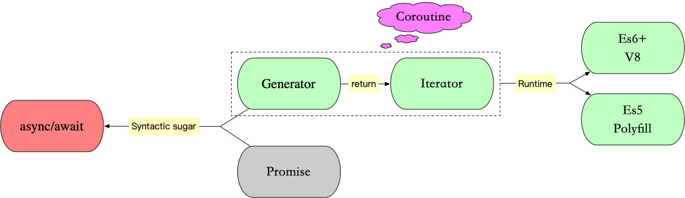

# Async/Await 深入理解

- last update：2020-12-14

<a href="https://github.com/daolou/book" class="github-corner" aria-label="View source on GitHub"><svg width="80" height="80" viewBox="0 0 250 250" style="fill:#151513; color:#fff; position: absolute; top: 0; border: 0; right: 0;" aria-hidden="true"><path d="M0,0 L115,115 L130,115 L142,142 L250,250 L250,0 Z"></path><path d="M128.3,109.0 C113.8,99.7 119.0,89.6 119.0,89.6 C122.0,82.7 120.5,78.6 120.5,78.6 C119.2,72.0 123.4,76.3 123.4,76.3 C127.3,80.9 125.5,87.3 125.5,87.3 C122.9,97.6 130.6,101.9 134.4,103.2" fill="currentColor" style="transform-origin: 130px 106px;" class="octo-arm"></path><path d="M115.0,115.0 C114.9,115.1 118.7,116.5 119.8,115.4 L133.7,101.6 C136.9,99.2 139.9,98.4 142.2,98.6 C133.8,88.0 127.5,74.4 143.8,58.0 C148.5,53.4 154.0,51.2 159.7,51.0 C160.3,49.4 163.2,43.6 171.4,40.1 C171.4,40.1 176.1,42.5 178.8,56.2 C183.1,58.6 187.2,61.8 190.9,65.4 C194.5,69.0 197.7,73.2 200.1,77.6 C213.8,80.2 216.3,84.9 216.3,84.9 C212.7,93.1 206.9,96.0 205.4,96.6 C205.1,102.4 203.0,107.8 198.3,112.5 C181.9,128.9 168.3,122.5 157.7,114.1 C157.9,116.9 156.7,120.9 152.7,124.9 L141.0,136.5 C139.8,137.7 141.6,141.9 141.8,141.8 Z" fill="currentColor" class="octo-body"></path></svg></a><style>.github-corner:hover .octo-arm{animation:octocat-wave 560ms ease-in-out}@keyframes octocat-wave{0%,100%{transform:rotate(0)}20%,60%{transform:rotate(-25deg)}40%,80%{transform:rotate(10deg)}}@media (max-width:500px){.github-corner:hover .octo-arm{animation:none}.github-corner .octo-arm{animation:octocat-wave 560ms ease-in-out}}</style>

首先想要更好的理解 Async/Await，需要了解这两个知识点：

- 同步
- 异步

## 背景

首先，**js 是单线程的（重复三遍）**，所谓单线程，
通俗的讲就是，~~一根筋~~（比喻有点过分，哈哈）执行代码是一行一行的往下走（即所谓的**同步**），
如果上面的没执行完，就痴痴的等着（是不是很像恋爱中在路边等她/他的你，假装 new 了个对象，啊哈哈哈，调皮一下很开心），
还是举个 🌰 吧：

```javascript
// chrome 81
function test() {
  let d = Date.now();
  for (let i = 0; i < 1e8; i++) {}
  console.log(Date.now() - d); // 62ms-90ms左右
}

function test1() {
  let d = Date.now();

  console.log(Date.now() - d); // 0
}

test();
test1();
```

上面仅仅是一个 for 循环，而在实际应用中，会有大量的网络请求，它的响应时间是不确定的，这种情况下也要痴痴的等么？显然是不行的，因而 js 设计了异步，即 发起网络请求（诸如 IO 操作，定时器），由于需要等服务器响应，就先不理会，而是去做其他的事儿，等请求返回了结果的时候再说（即**异步**）。
那么如何实现异步呢？其实我们平时已经在大量使用了，那就是 `callback`，例如：

```javascript
// 网络请求
$.ajax({
  url: 'http://xxx',
  success: function(res) {
    console.log(res);
  },
});
```

success 作为函数传递过去并不会立即执行，而是等请求成功了才执行，即**回调函数**（callback）

```javascript
// IO操作
const fs = require('fs');

fs.rename('旧文件.txt', '新文件.txt', err => {
  if (err) throw err;
  console.log('重命名完成');
});
```

和网络请求类似，等到 IO 操作有了结果（无论成功与否）才会执行第三个参数：`(err)=>{}`

从上面我们就可以看出，实现异步的核心就是回调钩子，将 cb 作为参数传递给异步执行函数，当有了结果后在触发 cb。想了解更多，去看看 `event-loop` 机制吧。

至于 async/await 是如何出现的呢，在 es6 之前，大多 js 数项目中会有类似这样的代码：

```javascript
ajax1(url, () => {
  // do something 1
  ajax2(url, () => {
    // do something 2
    ajax3(url, () => {
      // do something 3
      // ...
    });
  });
});
```

这种函数嵌套，大量的回调函数，使代码阅读起来晦涩难懂，不直观，形象的称之为**回调地狱（callback hell）**，所以为了在写法上能更通俗一点，es6+陆续出现了 `Promise`、`Generator`、`Async/await`，力求在写法上简洁明了（扁平化），可读性强（更优雅、更简洁）。

========================= 我是分割线 ==========================

以上只是铺垫，下面在进入正题 👇，开始说道说道主角：`async/await`

========================= 我是分割线 ==========================

`async/await` 是参照 `Generator` 封装的一套异步处理方案，可以理解为 `Generator` 的语法糖，



所以了解 `async/await` 就不得不讲一讲 `Generator`(首次将协程的概念引入 `js`，是协程的子集，不过由于不能指定让步的协程，只能让步给生成器(迭代器)的调用者，所以也称为非对称协程),

而 `Generator` 又返回迭代器`Iterator`对象，

所以就得先讲一讲 `Iterator`,

而 `Iterator` 和 `Generator` 都属于协程，

终于找到源头了：协程

## 协程

> wiki：[协程](https://zh.m.wikipedia.org/zh-cn/%E5%8D%8F%E7%A8%8B)（英语：coroutine）是计算机程序的一类组件，推广了协作式多任务的子程序，允许执行被挂起与被恢复。相对子例程而言，协程更为一般和灵活，但在实践中使用没有子例程那样广泛。协程更适合于用来实现彼此熟悉的程序组件，如协作式多任务、异常处理、事件循环、迭代器、无限列表和管道
>
> 协程可以通过 yield（取其“让步”之义而非“出产”）来调用其它协程，接下来的每次协程被调用时,从协程上次 yield 返回的位置接着执行，通过 yield 方式转移执行权的协程之间不是调用者与被调用者的关系，而是彼此对称、平等的
>
> 协程是追求极限性能和优美的代码结构的产物
> 协程间的调用是逻辑上可控的，时序上确定的

协程是一种比线程更加轻量级的存在，是语言层级的构造，可看作一种形式的[控制流](https://zh.m.wikipedia.org/wiki/控制流)，在内存间执行，无像线程间切换的开销。你可以把协程看成是跑在线程上的任务，一个线程上可以存在多个协程，但是在线程上同时只能执行一个协程。

协程概念的提出比较早，单核CPU场景中发展出来的概念，通过提供**挂起**和**恢复**接口，实现在单个CPU上交叉处理多个任务的并发功能。

那么本质上就是在一个线程的基础上，增加了不同任务栈的切换，通过不同任务栈的挂起和恢复，线程中进行交替运行的代码片段，实现并发的功能。

其实从这里可以看出 「协程间的调用是逻辑上可控的，时序上确定的」

那么如何理解 js 中的协程呢？

- js 公路只是单行道（主线程），但是有很多车道（辅助线程）都可以汇入车流（异步任务完成后回调进入主线程的任务队列）
- `generator` 把 js 公路变成了多车道（协程实现），但是同一时间只有一个车道上的车能开（依然单线程），不过可以自由变道（移交控制权）

### 协程实现

这里是一个简单的例子证明协程的实用性。假设这样一种生产者－消费者的关系，一个协程生产产品并将它们加入队列，另一个协程从队列中取出产品并消费它们。伪码表示如下：

```txt
var q := 新建队列

coroutine 生产者
  loop
    while q 不满载
      建立某些新产品
      向 q 增加这些产品
    yield 给消费者

coroutine 消费者
  loop
    while q 不空载
      从 q 移除某些产品
      使用这些产品
    yield 给生产者
```

v8 实现源码：[js-generator](https://github.com/v8/v8/blob/master/src/objects/js-generator.h)、[runtime-generator](https://github.com/v8/v8/blob/master/src/runtime/runtime-generator.cc)

编译模拟实现(es5)：[regenerator](https://github.com/facebook/regenerator)

通过以上，我假装你明白什么是协程，下一步开始说一说**迭代器** `Iterator`

## Iterator

`Iterator` 翻译过来就是**迭代器（遍历器）**让我们先来看看它的遍历过程(类似于单向链表)：

- 创建一个**指针对象**，指向当前数据结构的起始位置
- 第一次调用指针对象的 `next` 方法，将指针指向数据结构的第一个成员
- 第二次调用指针对象的 `next` 方法，将指针指向数据结构的第二个成员
- 不断的调用指针对象的 `next` 方法，直到它指向数据结构的结束位置

一个对象要变成可迭代的，必须实现 `@@iterator` 方法，即对象（或它原型链上的某个对象）必须有一个名字是 `Symbol.iterator` 的属性（原生具有该属性的有：`String`、`Array`、`TypedArray`、`Map` 和 `Set`）可通过常量 `Symbol.iterator` 访问：

| 属性               | 值                                               |
| :----------------- | :----------------------------------------------- |
| [Symbol.iterator]: | 返回一个对象的无参函数，被返回对象符合迭代器协议 |

当一个对象需要被迭代的时候（比如开始用于一个 `for..of` 循环中），它的 `@@iterator` 方法被调用并且无参数，然后返回一个用于在迭代中获得值的迭代器

迭代器协议：产生一个有限或无限序列的值，并且当所有的值都已经被迭代后，就会有一个默认的返回值

当一个对象只有满足下述条件才会被认为是一个迭代器：

它实现了一个 `next()` 的方法，该方法**必须返回一个对象**,对象有两个必要的属性：

- `done`（bool）
  - true：迭代器已经超过了可迭代次数。这种情况下,value 的值可以被省略
  - 如果迭代器可以产生序列中的下一个值，则为 false。这等效于没有指定 done 这个属性
- `value` 迭代器返回的任何 JavaScript 值。done 为 true 时可省略

根据上面的规则，咱们来自定义一个简单的迭代器：

```javascript
const getRawType = (target) => Object.prototype.toString.call(target).slice(8,-1);

const __createArrayIterable = (arr) => {
  if (typeof Symbol !== 'function' || !Symbol.iterator) return {};
  if(getRawType(arr) !== 'Array') throw new Error('it must be Array');
  const iterable = {};
  iterable[Symbol.iterator] = () => {
    arr.length++;
    const iterator = {
      next: () => ({ value: arr.shift(), done: arr.length <= 0 })
    }
    return iterator;
  };
  return iterable;
};

const itable = __createArrayIterable(['人月',  '神话']);
const it = itable[Symbol.iterator]();

console.log(it.next()); // { value: "人月", done: false }
console.log(it.next()); // { value: "神话", done: false }
console.log(it.next()); // {value: undefined, done: true }
```

我们还可以自定义一个可迭代对象：

```javascript
Object.prototype[Symbol.iterator] = function () {
  const items = Object.entries(this);
  items.length++;
  return {
    next: () => ({ value: items.shift(), done: items.length <= 0 })
  }
}
// or
Object.prototype[Symbol.iterator] = function* () {
  const items = Object.entries(this);
  for (const item of items) {
    yield item;
  }
}
const obj = { name: 'amap', bu: 'sharetrip'}
for (let value of obj) {
  console.log(value);
}
// ["name", "amap"]
// ["bu", "sharetrip"]
// or
console.log([...obj]); // [["name", "amap"], ["bu", "sharetrip"]]
```

### 💡 除了 for map forEach 等方法如何遍历一个数组？

<details>
<summary>参考答案</summary>
<pre><code>
const getIterator = (iteratorable) => iteratorable[Symbol.iterator]();
const arr = [0,1,2,3,4,5];
const iterator = getIterator(arr);
while(true){
  const obj = iterator.next();
  if(obj.done){
    break;
  }
  console.log(obj.value);
}
</code></pre>
</details>

了解了迭代器，下面可以进一步了解生成器了

## Generator

`Generator`：生成器对象是生成器函数（GeneratorFunction）返回的，它符合**可迭代协议**和**迭代器协议**，既是迭代器也是可迭代对象，可以调用 `next` 方法，但它不是函数，更不是构造函数

生成器函数（GeneratorFunction）：

> function\* name([param[, param[, ... param]]]) { statements }
>
> - name：函数名
> - param：参数
> - statements：js 语句

调用一个生成器函数并不会马上执行它里面的语句，而是返回一个这个生成器的迭代器对象，当这个迭代器的 `next()` 方法被首次（后续）调用时，其内的语句会执行到第一个（后续）出现 `yield` 的位置为止（让执行处于**暂停状**，挂起），`yield` 后紧跟迭代器要返回的值。或者如果用的是 `yield*`（多了个星号），则表示将执行权移交给另一个生成器函数（当前生成器**暂停执行**），调用 `next()` （再启动，唤醒）方法时，如果传入了参数，那么这个参数会作为**上一条执行的 `yield` 语句的返回值**，例如：

```javascript
function* another() {
  yield '人月神话';
}

function* gen() {
  yield* another(); // 移交执行权
  const a = yield 'hello';
  const b = yield a; // a='world' 是 next('world') 传参赋值给了上一个 yidle 'hello' 的左值
  yield b; // b=！ 是 next('！') 传参赋值给了上一个 yidle a 的左值
}

const g = gen();
g.next(); // {value: "人月神话", done: false}
g.next(); // {value: "hello", done: false}
g.next('world'); // {value: "world", done: false} 将 'world' 赋给上一条 yield 'hello' 的左值，即执行 a='world'，
g.next('!'); // {value: "!", done: false} 将 '!' 赋给上一条 yield a 的左值，即执行 b='!'，返回 b
g.next(); // {value: undefined, done: false}
```

看到这里，你可能会问，`Generator` 和 `callback` 有啥关系，如何处理异步呢？其实二者没有任何关系，我们只是通过一些方式强行的它们产生了关系，才会有 `Generator` 处理异步

我们来总结一下 `Generator` 的本质，暂停，它会让程序执行到指定位置先暂停（`yield`），然后再启动（`next`），再暂停（`yield`），再启动（`next`），而这个暂停就很容易让它和异步操作产生联系，因为我们在处理异步时：开始异步处理（网络求情、IO 操作），然后暂停一下，等处理完了，再该干嘛干嘛。不过值得注意的是，**js 是单线程的（又重复了三遍）**，异步还是异步，callback 还是 callback，不会因为 `Generator` 而有任何改变

下面来看看，用 `Generator` + `Promise` 写一段异步代码：

```javascript
const gen = function*() {
  const res1 = yield Promise.resolve({a: 1});
  const res2 = yield Promise.resolve({b: 2});
};

const g = gen();

const g1 = g.next();

console.log('g1:', g1);

g1.value
  .then(res1 => {
    console.log('res1:', res1);
    const g2 = g.next(res1);
    console.log('g2:', g2);
    g2.value
      .then(res2 => {
        console.log('res2:', res2);
        g.next(res2);
      })
      .catch(err2 => {
        console.log(err2);
      });
  })
  .catch(err1 => {
    console.log(err1);
  });
// g1: { value: Promise { <pending> }, done: false }
// res1: { "a": 1 }
// g2: { value: Promise { <pending> }, done: false }
// res2: { "b": 2 }
```

以上代码是 `Generator` 和 `callback` 结合实现的异步，可以看到，仍然需要手动执行 `.then` 层层添加回调，但由于 `next()` 方法返回对象 `{value: xxx,done: true/false}` 所以我们可以简化它，写一个自动执行器：

```javascript
function run(gen) {
  const g = gen();

  function next(data) {
    const res = g.next(data);
    // 深度递归，只要 `Generator` 函数还没执行到最后一步，`next` 函数就调用自身
    if (res.done) return res.value;
    res.value.then(function(data) {
      next(data);
    });
  }

  next();
}

run(function*() {
  const res1 = yield Promise.resolve({a: 1});
  console.log(res1);
  // { "a": 1 }
  const res2 = yield Promise.resolve({b: 2});
  console.log(res2);
  // { "b": 2 }
});
```

说了这么多，怎么还没有到 `async/await`，客官别急，马上来了（其实我已经漏了一些内容没说：Promise 和 callback 的关系，thunk 函数，co 库，感兴趣的可以去 google 一下，ruanyifeng 老师讲的[es6 入门](http://es6.ruanyifeng.com)非常棒，我时不时的都会去看一看）

### 💡 分析下面 log 输出什么内容？

```js
function* gen() {
  const ask1 = yield "2 + 2 = ?";
  console.log(ask1);

  const ask2 = yield "3 * 3 = ?"
  console.log(ask2);
}

const generator = gen();

console.log( generator.next().value );

console.log( generator.next(4).value );

console.log( generator.next(9).done );
```

<details>
<summary>参考答案</summary>
<pre><code>
// 2 + 2 = ?
// 4
// 3 + 3 = ?
// 6
// true
</code></pre>
</details>

## Async/Await

首先，`async/await` 是 `Generator` 的语法糖，上面*我是分割线*下的第一句已经讲过，先来看一下二者的对比：

```javascript
// Generator
run(function*() {
  const res1 = yield Promise.resolve({a: 1});
  console.log(res1);

  const res2 = yield Promise.resolve({b: 2});
  console.log(res2);
});

// async/await
const aa = async ()=>{
  const res1 = await Promise.resolve({a: 1});
  console.log(res1);

  const res2 = await Promise.resolve({b: 2});
  console.log(res2);

  return 'done'；
}
const res = aa();
```

可以看到，`async function` 代替了 `function*`，`await` 代替了 `yield`，同时也无需自己手写一个自动执行器 `run` 了

现在再来看看`async/await` 的特点：

- 当 `await` 后面跟的是 Promise 对象时，才会异步执行，其它类型的数据会同步执行
- 执行 `const res = aa();` 返回的仍然是个 Promise 对象，上面代码中的 `return 'done';` 会直接被下面 `then` 函数接收到

```javascript
res.then(data => {
  console.log(data); // done
});
```

最后咱们来总结一下：

优点：

- 内置执行器：自带执行器
- 更好的语义：比起星号和 `yield`，语义更清楚了
- 更广的适用性：`await` 命令后面，可以跟 `Promise` 对象和原始类型的值（这时等同于同步操作）

注意点：

- `await` 命令后面的 `Promise` 对象，运行结果可能是 `rejected`，所以最好把 `await` 命令放在 `try...catch` 代码块中
- `await` 命令只能用在 `async` 函数之中，如果用在普通函数，就会报错
- 多个 `await` 命令后面的异步操作，如果不存在继发关系，最好让它们同时触发（`Promise.all`）
- 再循环中需注意它的使用，尽量在 `for/for..of`（迭代遍历器） 中使用，永远不要在 `forEach/filter` 中使用，也尽量不要在 `map` 中使用
- 兼容性（[caniuse](https://caniuse.com/)、[node.green](https://node.green/)）不太好，当然一般情况下，可以借助编译工具来进行  polyfill（babel）或 es6-shim（转换后即语法糖实现的协程效率低，`co + generator` 比 `cb` 的方式性能差）
- 可以在生命周期函数中使用，在线例子:  [React](https://codesandbox.io/s/async-zai-componentdidmount-zhongdeshiyong-dcwq9?file=/src/components/AsyncCom.tsx)、[Vue](https://codesandbox.io/s/zai-mounted-zhongshiyong-asyncawait-hpbct?file=/src/components/AsyncCom.vue)
- 错误捕获：需要捕获多个错误并做不同的处理时，可以考虑给 `await` 后的 `promise` 对象添加 `catch` 函数，为此我们需要写一个 `helper`:

```javascript
// to.js
export default function to(promise) {
  return promise.then(data => {
    return [null, data];
  })
  .catch(err => [err]);
}

/***使用***/
import to from './to';

async function asyncTask() {

  const [err1, res1] = await to(fn1);
  if(!res1) throw new CustomerError('No res1 found');

  const [err2, res2] = await to(fn2);
  if(err) throw new CustomError('Error occurred while task2');
}
```

### 💡 给定一个 URL 数组，如何实现接口的继发和并发？

<details>
<summary>参考答案</summary>
<pre><code>
// 继发一
async function loadData() {
  var res1 = await fetch(url1);
  var res2 = await fetch(url2);
  var res3 = await fetch(url3);
  return "when all done";
}
// 继发二
async function loadData(urls) {
  for (const url of urls) {
    const response = await fetch(url);
    console.log(await response.text());
  }
}
/********/
// 并发一
async function loadData() {
  var res = await Promise.all([fetch(url1), fetch(url2), fetch(url3)]);
  return "when all done";
}
// 并发二
async function loadData(urls) {
  // 并发读取 url
  const textPromises = urls.map(async url => {
    const response = await fetch(url);
    return response.text();
  });
  // 按次序输出
  for (const textPromise of textPromises) {
    console.log(await textPromise);
  }
}
</code></pre>
</details>

啊，终于完了，一个 `async-await` 连带出来这么多知识点，以后在使用它时，希望能够帮助到你

【参考】：

1. <https://developer.mozilla.org/zh-CN/docs/Web/JavaScript/Reference/Iteration_protocols#%E5%8F%AF%E8%BF%AD%E4%BB%A3%E5%8D%8F%E8%AE%AE>
2. <http://es6.ruanyifeng.com/#docs/iterator>
3. <http://es6.ruanyifeng.com/#docs/async>

===🧐🧐 _文中不足，欢迎指正_ 🤪🤪===
